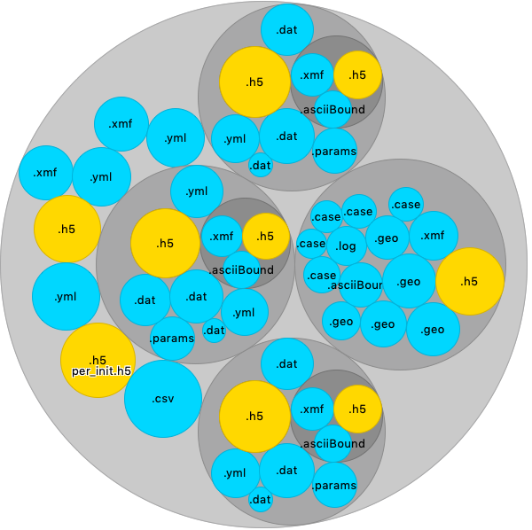

# NOB VISUAL

Visualization of nested objects.
The main output is a circular packing in Tkinter with an "hover interaction".
By hovering over the circles, the user can peek at the content.



*Example of nobvisual on a folder structure. Three subfolders show a similar content. Yellow circles are binary files, blue are ASCII files*.

This last example is for a nested object build on a folder structure, but nob visual output can be run on various nested objects, particularly or JSON or YAML contents.

## Installation

Installation using Pypi:

```bash
> pip install nobvisual
```

## Usage

Use the CLI for a basic terminal usage.

```bash
 ---------------    NOB VISUAL  --------------------

  You are now using the Command line interface of Nob Visual a Python3
  helper to explore Nested Objects, created at CERFACS (https://cerfacs.fr).

  This package is mean to be used as a dependency of other packages, to
  provide a tkinker canvas rendering the nested structure of nesteds
  objects.

  This is a python package currently installed in your python environement.

Options:
  --help  Show this message and exit.

Commands:
  cmpfile   Compare the content of two serialization files.
  tree      Show current wkdir visually.
  treefile  Show the content of a serialization file.

````
