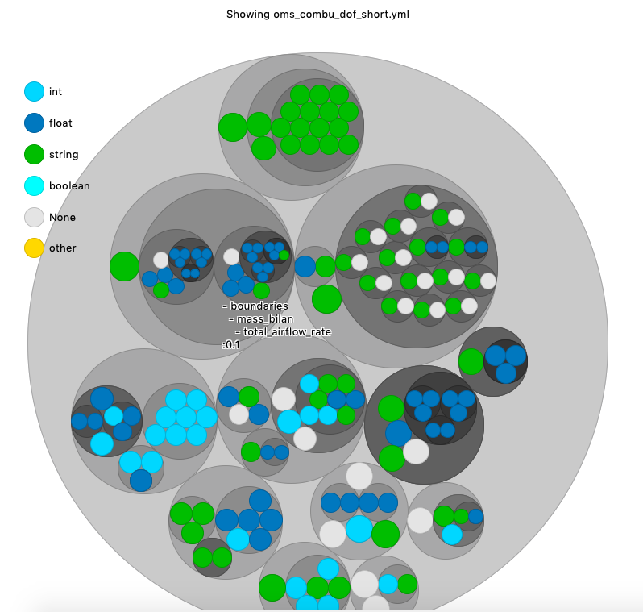
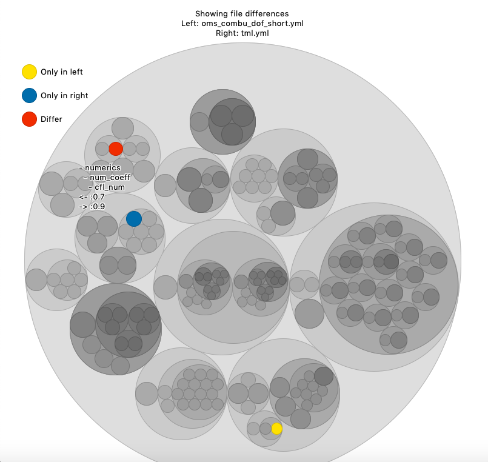

# Content

## Folder visualization

The command `>nobvisual tree` is equivalent to the `tree` command, but visually.
It gives the following output:

The size of each circle *at the same level* is proportional to the log10 size of each objects.
The CLI trigger the function `nobvisual.visual_tree(wkdir)`.

## Serialization file visualization

The command `>nobvisual treefile` shows the content of a serialization file.
Supported formats are :
- YAML
- JSON

It gives the following output:

Colors are illustrating the type of record found at the end of each branch.
The size of each node is proportional to the number records depending of the nodes.
The command calls the function `nobvisual.visual_treefile(path)`.

## Serialization file comparison

The command `>nobvisual cmpfile` compares the content of two serialization file.
Supported formats are the same as before

It gives the following output:

Colors help to understand what is only in the *left* file, only on the *right$ file, or differ between the two.
The command calls the function `nobvisual.visual_comparefile(path_left, path_right)`.

If you use a custom file format for your data, and you can express it in a nested object, maybe you will be interested in the next function `nobvisual.nob_compare_tkinter(noba, nobb, title=None)`.
