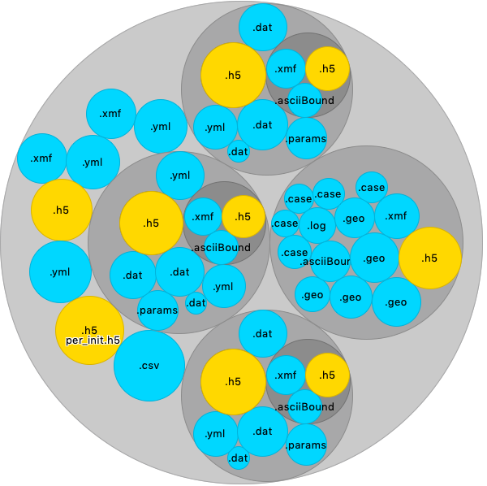

*WORK IN PROGRES*

# NOB VISUAL

Visualization of nested objects.
The main output is a circular packing in Tkinter with an "hover interaction".
By hovering over the circles, the user can peek at the content.




*Example of nobvisual on a folder structure. Three subfolders show a similar content. Yellow circles are binary files, blue are ASCII files*.

This last example is for a nested object build on a folder structure, but nob visual outpout can be run on various nested objects, particularly or JSON or YAML contents.


## Installation

Installation using Pypi:

```bash
> pip install nobvisual
```

## Usage

Use the CLI 

```bash
> nobvisual
````
